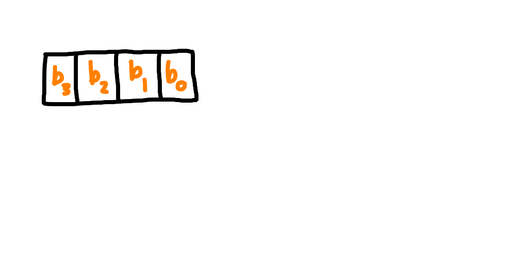

# Data Structure

Before we talk about the nodes that make up the data structure, it will help to first talk about bitmaps and hash tables, which are the actual data components that organize each node.

## Bitmap

A `bitmap` relies on the binary representation of a number, using each bit to indicate some predicate about each position.
A `1` at a particular index in the bitmap means for that position, the predicate is true.
A `0` at a particular index in the bitmap means for that position, the predicate is false.
In the context of our data structure, a bitmap is used with a predicate of *a child exists at this bit index*.
For our 4-child trees, we care about the possibilities for all bitmap values with 4 bits (1 per child).
This means that the only valid bitmaps for the 4-child HAMT are 0-15.
Note that for this implementation, no care was taken to make this a word, only the first four bits of a bitmap contain relevant information.
The index values into the bit map read from right-to-left (LSB) order, with index 0 as the rightmost bit and index 3 as the leftmost bit for a 4 child node.



| Bitmap position | Index |
|---|---|
| b0 | 0 |
| b1 | 1 |
| b2 | 2 |
| b3 | 3 |

So, the way to interpret a bit map is to convert in to binary first, and then use each bit to determine if a child exists at that index.

### Examples

1 . Bitmap value of `5`

First, we convert to binary, `0101`, and then we can get the following information

| Bitmap Position | Index | Bit Value | Child exists |
|---|---|---|---|
| b0 | 0 | 1 | True |
| b1 | 1 | 0 | False |
| b2 | 2 | 1 | True |
| b3 | 3 | 0 | False |

This means that 2 children exist, at index values 0 and 2.

2 . Bitmap value of `9`

First, convert to binary, `1001`, and then we can get the following information

| Bitmap Position | Index | Bit Value | Child exists |
|---|---|---|---|
| b0 | 0 | 1 | True |
| b1 | 1 | 0 | False |
| b2 | 2 | 0 | False |
| b3 | 3 | 1 | True |

This means that 2 children exist, at index values 0 and 3.

### Exercises

1 . Create a table for `2`, determine which children exist using the table.

2 . Create a table for `15`, determine which children exist using the table.

3 . Determine the bitmap for when there are 3 children at index values 0, 2, and 3.

### Answers

1 . Create a table for `2`

First, convert to binary, `0010`.

| Bitmap Position | Index | Bit Value | Child exists |
|---|---|---|---|
| b0 | 0 | 0 | False |
| b1 | 1 | 1 | True |
| b2 | 2 | 0 | False |
| b3 | 3 | 0 | False |

This means that a single child exists, at index 1.

2 . Create a table for `15`

First, convert to binary, `1111`.

| Bitmap Position | Index | Bit Value | Child exists |
|---|---|---|---|
| b0 | 0 | 1 | True |
| b1 | 1 | 1 | True |
| b2 | 2 | 1 | True |
| b3 | 3 | 1 | True |

This means that 4 children exist, at index values 0,1,2, and 3.

3 . Determine the bitmap for when there are 3 children at index values 0, 2, and 3.

First, create a table that incorporates this information.

| Bitmap Position | Index | Bit Value | Child exists |
|---|---|---|---|
| b0 | 0 | 1 | True |
| b1 | 1 | 0 | False |
| b2 | 2 | 1 | True |
| b3 | 3 | 1 | True |

Now the bit value column can be used to construce the binary value `1011`, which corresponds to the bitmap value of `13`.

## Hash Table

With an understanding of the bitmap, now we can understand how a hash table is used to store children.

A `hash table` is associated with a bitmap to hold the children that are present.
The bitmap serves as a conceptual array, where for each of the four child index values we may or may not have a child.
For `1` values in the bitmap, that means a child is present in the hash table.
For `0` values in the bitmap, children are not present in the hash table.

If some sort of sentinel value, like nil, were used, all that would be needed to implement the hash table is to initialize an array with 4 elements, where each position is nil initially to indicate no children.
To update this hash table, you would just access it by index directly to add or remove a child.
The problem with this solution is that as you grow the number of children (here 4, in Clojure's native implementation 32), you would waste a lot of space for children that aren't, and may never be realized.

The trick mentioned in the HAMT paper is that we will still use an array, but we will use a bit operation in a clever way to figure out a way to store only the children that are present.
This works conceptually by an algorithm where you count the bits that preceed (to the right) a given index in the bitmap to account for how many other children are in the array and then add 1 to that to account for the desired position, and that will give you the index to use into the hash table array.
This will ensure that there is no wasted space, and as long as this bit operation is fast, you don't waste time.

### Examples

Lets look at 15, a made up `bitmap` value, to start.

15 can be converted to binary

`1111`

Each bit represents the presence of a child, so to get the number of children that
are contained in `hash table`, convert `bitmap` to binary, and count the number
of `1`s that are there (4 in this case). This means that `b0` corresponds to index 0, `b1` to 1, `b2` to 2, and `b3` to 3.

To try another, consider the `bitmap` 5

5 can be converted to binary

`0101`

This means there are two children in `hash table`, one to represent `b0` at index 0 and one to represent `b2` at index 1.

### Exercises

TODO: Add here

### Answers

TODO: Add here

## Node Types

The data structure is made up of three types of nodes, and with the concepts of `bitmaps` and `hash tables` we can define them.

```clojure
(def node-types #{:root :sub-hash :node})
```

### :root

There is a single `:root` node, which can be accessed with `simple-hamt.core/empty-hash-map`.
Every other node in the data structure is either a `:sub-hash` node or a `:node` node.
This node has a `:bitmap` of 0 and a `:hash-table` of [].
These correspond to the bitmap and hash table that were discussed earlier.
As keys and values are added to the hash-map, these two values will change to maintain their meaning.

### :sub-hash

The nice thing is, since we have discussed `:root`, we already understand `:sub-hash` nodes.
`:sub-hash` nodes have `:bitmap` and `:hash-table` keys, just like the `:root` node.
The only reason I differentiate between the two is that the HAMT paper did, and I assumed that was so that it is clear where the root of the tree is.

### :node

`:node` nodes are ones that actually relate to the data you want to store in the tree, which contrast the purpose of `:sub-hash` nodes (which are used for book-keeping and orginization to allow quick access and modification).
These nodes have `:key` and `:value` keys.
`:key` is needed to properly identify matches when retrieving values from the HAMT.
`:value` allows for the values to be stored.

### Data Structure Summary

We have now talked about all of the components that are used as building blocks to assemble our HAMTs.
A `:root` node is used like a container to hold all of our data.
`:sub-hash` nodes are used to grow the data structure as more data is added, allowing more levels of the tree to be created through their `:bitmap` and `:hash-table` keys.
`:node` nodes are used to hold the raw data that is stored in the tree.

Now that we have the building blocks, it is time to talk about how they work.
First we'll take a look at an existing data structure and work through how to access data that is stored in the tree.
This ignores how the data structure was created, with a focus on how to navigate through the tree.
After that, we'll discuss how to create the data structure.

[Get](./get.md)
